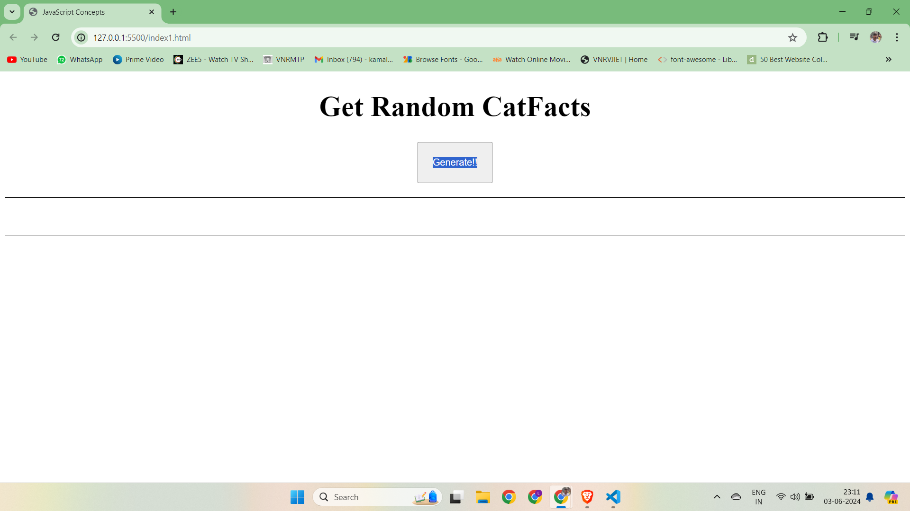
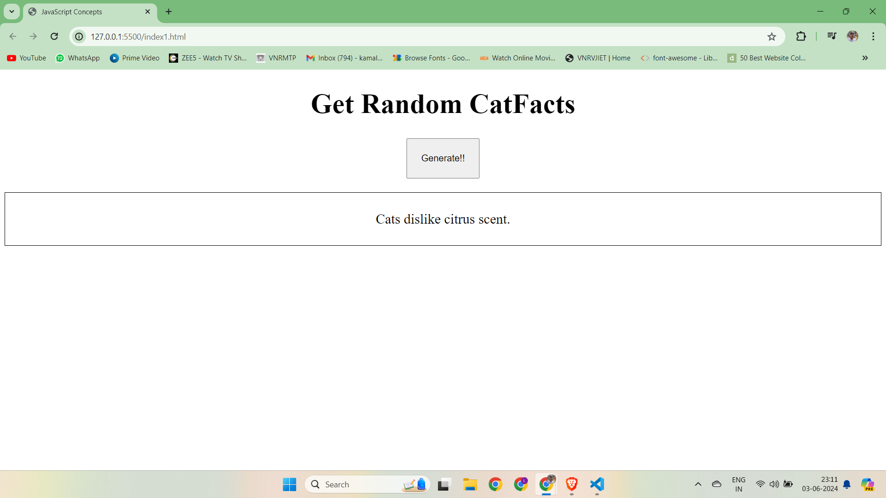
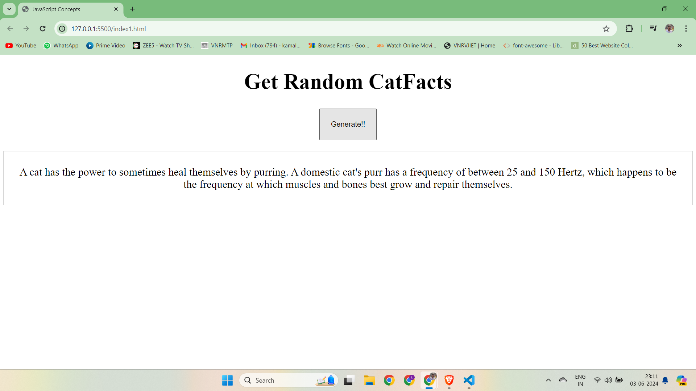

# getRandomCatFacts


# README

## Project Overview

This project is a simple web application that fetches random cat facts from the `https://catfact.ninja/fact` API and displays them on the web page when a button is clicked. The project uses modern JavaScript features, including `async/await` for asynchronous operations and the `axios` library for making HTTP requests.

## Table of Contents
- [Installation](#installation)
- [Usage](#usage)
- [Code Explanation](#code-explanation)
- [License](#license)

## Installation

To get this project up and running locally on your machine, follow these steps:

1. Navigate to the project directory:
   ```sh
   cd cat-facts
   ```

2. Open `index.html` in your favorite web browser.

## Usage

1. Ensure you have a working internet connection as the application fetches data from an online API.
2. Open `index.html` in a web browser.
3. Click the button to fetch and display a random cat fact.

## Code Explanation

### HTML
```html
<!DOCTYPE html>
<html lang="en">
<head>
    <meta charset="UTF-8">
    <meta name="viewport" content="width=device-width, initial-scale=1.0">
    <title>Cat Facts</title>
</head>
<body>
    <button>Get Cat Fact</button>
    <p id="result"></p>
       <script src="https://cdn.jsdelivr.net/npm/axios@1.6.7/dist/axios.min.js"></script>

    <script src="script.js"></script>
</body>
</html>
```
- A simple HTML file with a button and a paragraph to display the cat fact.
- The script `script.js` is included at the end of the body.

### JavaScript
```javascript
let btn = document.querySelector("button");
btn.addEventListener("click", async () => {
    let facto = await getFacts();
    console.log(facto);
    let p = document.querySelector("#result");
    p.innerText = facto;
});

let url = "https://catfact.ninja/fact";

async function getFacts() {
    try {
        let res = await axios.get(url);
        return res.data.fact;
    } catch (error) {
        console.log(error);
        return "No fact found";
    }
}
```
- `btn` selects the button element from the HTML.
- An event listener is added to the button, which calls the `getFacts` function when the button is clicked.
- `getFacts` function:
  - Makes an HTTP GET request to `https://catfact.ninja/fact` using `axios`.
  - If successful, it returns the cat fact from the response.
  - If there's an error, it logs the error and returns a fallback message.

## Demonstration






